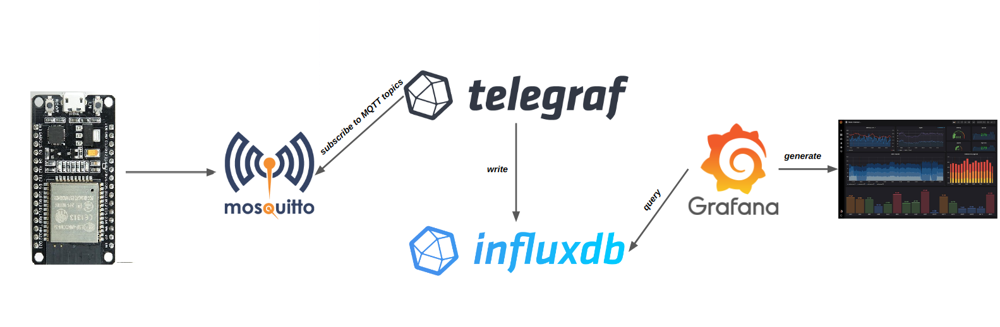
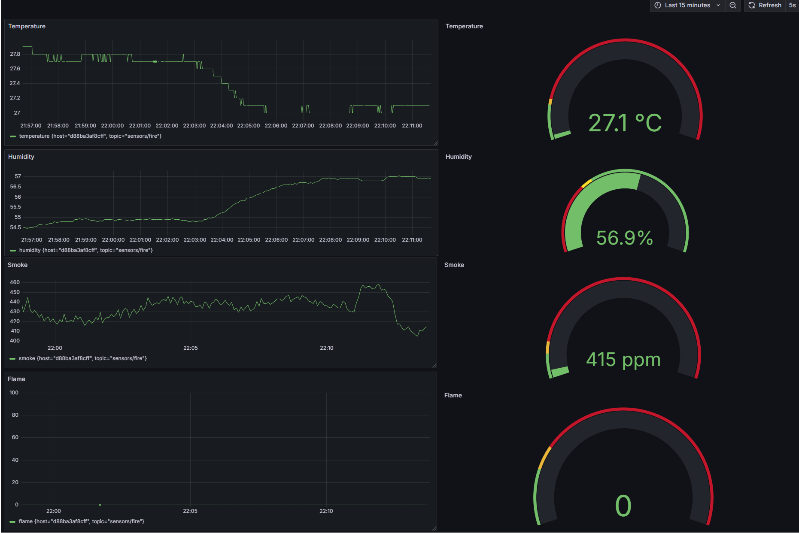
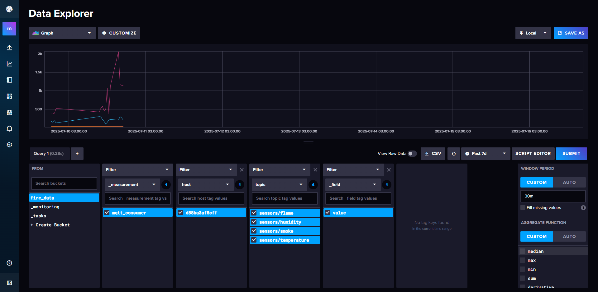

# IoT Fire Detection System

This project implements a **Smart IoT Fire Detection System** using an **ESP32 microcontroller**. It reads data from environmental sensors (temperature, humidity, smoke, flame) and sends it to an **MQTT broker**. The data is stored in **InfluxDB** and visualized in real time with **Grafana**. All services are containerized using **Docker Compose**.

# Feature

- Real-time monitoring of temperature, humidity, smoke (PPM), and flame.
- Wireless communication via Wi-Fi (ESP32).
- Local alarm via LEDs and buzzer when danger is detected.
- MQTT communication with Mosquitto broker.
- Data stored as time-series in InfluxDB.
- Interactive Grafana dashboards.
- Fully containerized setup using Docker Compose.

# Hardware Requirements

- ESP32 board
- DHT22 sensor (Temperature & Humidity)
- MQ-2 smoke sensor
- Flame sensor
- Buzzer
- 3 LEDs (green, yellow, red)

# Software Requirements

- Arduino IDE
- Libraries: `WiFiManager`, `PubSubClient`, `DHT`
- Docker & Docker Compose

# MQTT Topics

- `sensors/temperature`
- `sensors/humidity`
- `sensors/smoke`
- `sensors/flame`

# System Architecture

1. ESP32 reads sensor values.
2. Sends values to MQTT broker (Mosquitto).
3. Telegraf subscribes to MQTT and pushes data to InfluxDB.
4. Grafana fetches and visualizes the data from InfluxDB.

 


# Setup Instructure 

- Open `fire_detector.ino` in Arduino IDE.
- Install required libraries (`DHT`, `WiFiManager`, `PubSubClient`).
- Upload the code to the ESP32.
- On first boot, the ESP32 starts in Wi-Fi Access Point mode.
- Connect to the ESP32's Wi-Fi network (e.g., `FireDetector-Setup`) and open the configuration portal.
- Choose your local Wi-Fi network and enter your Wi-Fi credentials.
- The ESP32 saves the settings and will automatically reconnect to the same Wi-Fi and MQTT broker in future restarts.
- Εnter the MQTT broker IP address in the code (`const char* mqtt_server = " ";`).

### 2. Run the Docker Stack

```bash
docker-compose up -d
```
This will start:

- Mosquitto MQTT broker
- Telegraf collector
- InfluxDB time-series database
- Grafana dashboard server


### 3. Access Services

- **InfluxDB**: http://localhost:8086
- **Grafana**: http://localhost:3000  
(Default login: `admin` / `admin`)

# Visualization

Grafana dashboards show:

- Temperature and Humidity trends
- Smoke levels (PPM)
- Flame sensor status

# Screenshots






